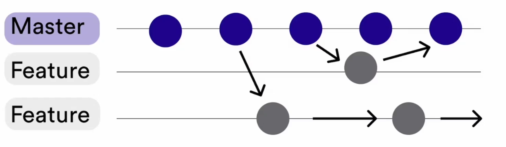
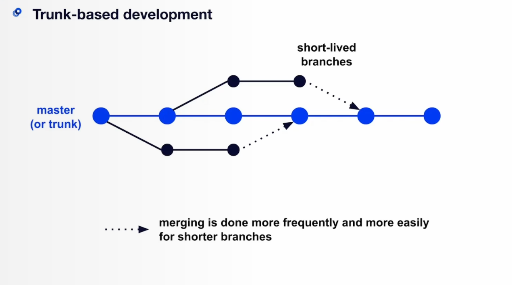
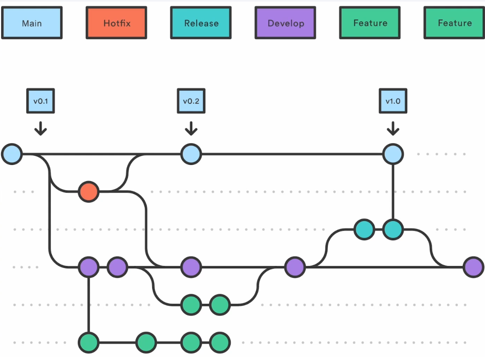
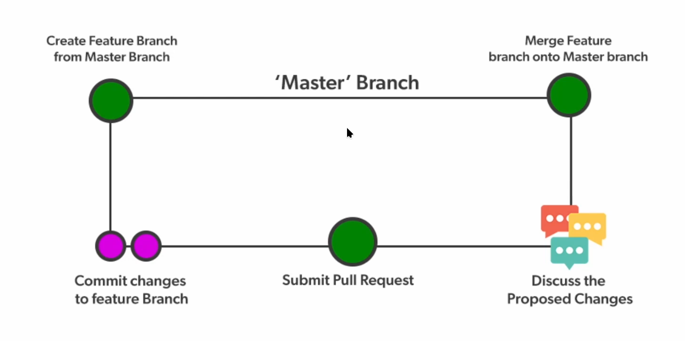

# CI/CD

це потік який об'єднує в собі `Continious Development` (CI) і `Continious Delivery` (CD). Головна ціль його автоматизувати і прискорити випуск нових версій до користувачів.

## CI (Continious Development)

Потік через який автомазовується випуск нових версій застосунку, теститься та збирається у тоговий до дистрибуції продукт.

### Branching Strategies

Існує декілька стратегій використовування Git для оптимізації випуску продукту

- **Feature Branching** - Розробники створюють нову ізольовану вітку feature під конкретну фічу чи баг. Основною проблемою є важкість інтеграції гілок в яких довго розробляється певний функціонал, може спричинити великі мерч конфлікти.

- **Trunk Based Development** - Основна гілка (main/master/trunk) стає основною для всіх розробнивків, всі коммітять на неї. Новий функціонал закривається за допомогою `feature toggle`(перевірка в коді чи показувати функціонал користувачам чи ні). Краще імлементується з **CI**.

- **Git Flow** - Використовується дві або більше головних гілок: `main` (офіційна версія релізу на кожний комміт) & `dev` (інтеграція усього функціоналу, який був написаний на `feature` гілках).

    На **feature** гілках розробляється увесь функціонал, котрий заливається у **dev**. Готовий функціонал заливається якомога частіше, а не готовий будуть закривати **feature toggle**.

    Коли **dev** набрав заплановану кількість функціоналу, то із нього створюють `release` гілку, якій виконуються малі допрацювання. Коли робота у **release** закінчилась, зміни мерджать у **main** та **dev**. В гілці **main**
    проставляють тег із версією релізу, із цього комміту буде розгорнутий додаток у `Prod`.

    Останній тип гілок це `hotfix`, з яких роблять якісь критичні зміни прямо у гілку **main**. Це робиться для прискорення процесу. Зміни потрапляють відразу у **main** і **dev**

- **GitHub Flow** - Проста стратегія, схожа на **Trunk Based Model**, але не зобов'язує до якомога швидшого мерча, із костилями у вигляді **feature toggle**. **Feature** гітки можуть жити довше, а акцент робиться на обговоренні. Після прийняття змін робиться `Pull Reguest` на **main**.

